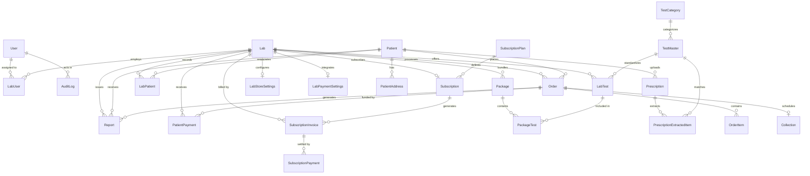

# Gyrex Labs — Entity Relationships & Schema Architecture

Version: 1.0  
Status: APPROVED FOUNDATION  

---

## 1. High-Level Entity Diagram

---

## 2. Relational Integrity & Cascade Rules

### Cascade Delete (`Cascade`):
- `Lab` → `LabUser`, `LabStoreSettings`, `LabPaymentSettings`, `LabTest`, `Package`, `LabPatient`: Deleting a test laboratory completely purges its dependent operational configuration.
- `Order` → `OrderItem`, `Collection`: Line items and home collection details are strictly lifecycle-bound to their parent Order.
- `Package` → `PackageTest`: Package junction records are dropped when a package is removed.
- `Prescription` → `PrescriptionExtractedItem`: Extracted candidate items belong solely to the parent prescription.

### Restrict (`Restrict`):
- `Lab` → `Order`, `Report`, `PatientPayment`: A laboratory with existing clinical orders, reports, or financial transactions **CANNOT** be physically deleted. This preserves statutory auditability and patient records.
- `TestMaster` → `LabTest`: A standardized master test cannot be deleted while active laboratories offer it in their catalogue.
- `LabTest` → `OrderItem`: Deleting a lab test is prohibited if past historical orders reference it. Soft deprecation (`isActive = false`) is used instead.
- `SubscriptionPlan` → `Subscription`: Active billing tiers cannot be dropped while laboratories are subscribed.

### Set Null (`SetNull`):
- `AuditLog.actorUserId`: If a staff member leaves or their user account is deleted, audit log records remain intact with `actorUserId = NULL` to ensure historical non-repudiation.
- `SupportTicket.assignedToUserId`: If an agent is unassigned or deleted, the ticket remains in the system for reassignment.
- `Prescription.labId`: If a lab is suspended or removed, patient prescription uploads remain preserved.
